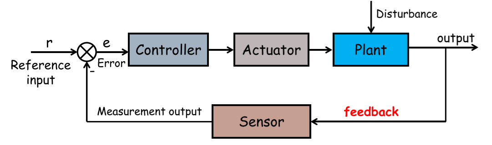
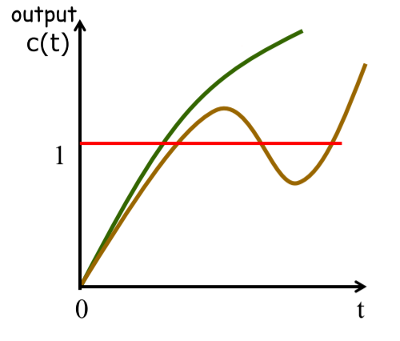
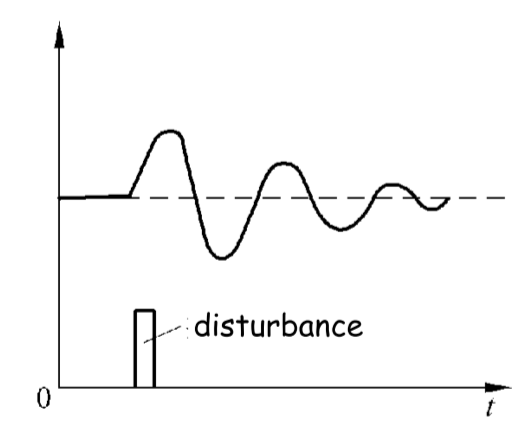

# Chapter 1

## Basic Terms and Concepts

- **Reference Components**: a reference component generates the reference signal or the input signal
- **Controlled Variable**: the quantity or condition that is measured and controlled
- **Comparison Components**: compare the input with feedback signal and generate the error signal
- **Plant** or Process: any physical object or operation to be controlled
- **Controller**: a compensation component, improves the performance ofg the system
- **Actuator**: acts on that plant directly to adjust the controlled variable
- **Disturbance**: a signal that tends to adversely affect the value of the output of a system
- **Sensor** or measurement component: measure the output or the controlled variable and generate feedback signal

### Examples

|               Control System                |      Plant       |   Controlled Variable   |
| :-----------------------------------------: | :--------------: | :---------------------: |
|  |    water tank    |       water level       |
|   | electric furnace | the furnace temperature |

## Types of Control

### Open-loop Control Systems

An open-loop system is a system without feed back

- the output of the open-loop system has no effect upon the input signal
- there is only forward action from the input to the output

#### Advantages

- simple construction and ease of maintenance
- less expensive
- no stability problem
- convenient when output is hard to measure

#### Disadvantages

- disturbance and changes in calibration cause errors
- to maintain the required quality in the output, recalibration is necessary from time to time

### Closed-loop Control System

A closed-loop control system uses a measurement of the output and feedback of this signal to compare it with the desired output

#### Features

- there are feedbacks in the system so that signals flow through closed loops
- the error signal controls the system

## General Requirements for Control Systems

- **Stability**: stability, smooth and steady
- **Swiftness**: peak time, settling time
- **Accuracy**: steady-state error

### Stable and Unstable

|Stable|Unstable|
|:--:|:--:|
|||
|||

### Regulation Process

The whole regulation process can be divided into two stages

**transient process** + **steady-state process**

- **transient process** reflects dynamic characteristics
- **steady-state process** reflects steady-state characteristics

#### Transient Response

- reflects **dynamic characteristics**
- swiftness: peak time, settling time

#### Steady-State Response

- reflects **steady-state characteristics**
- accuracy: steady-state error