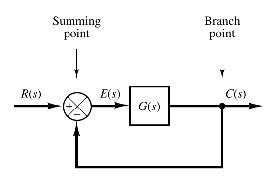
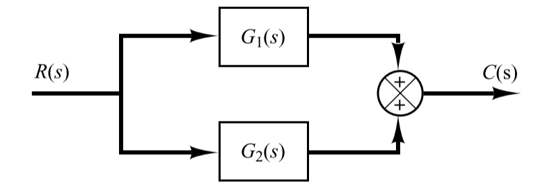
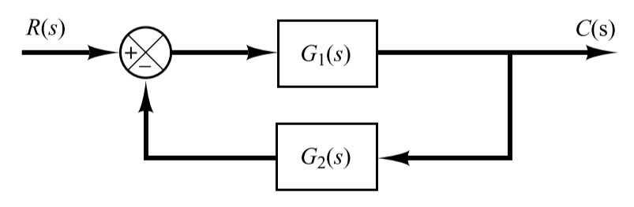
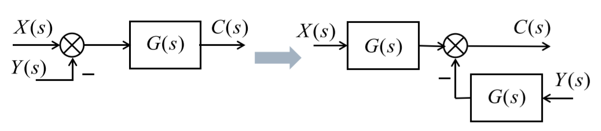
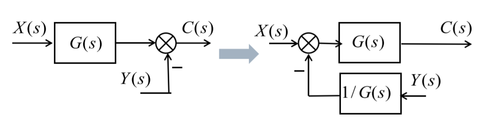
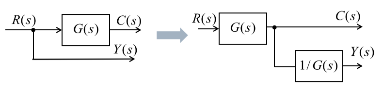
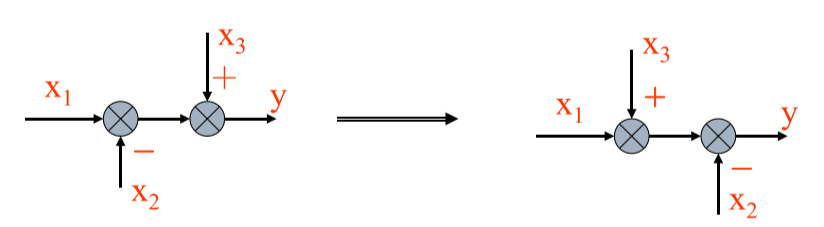
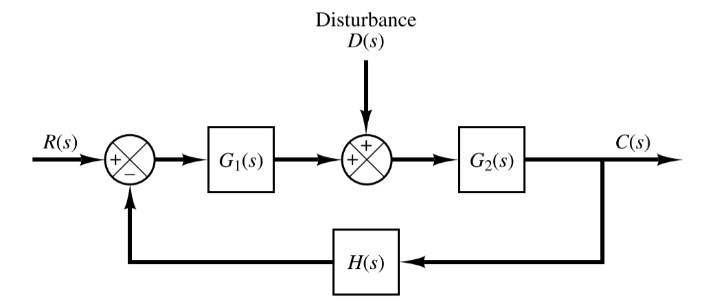
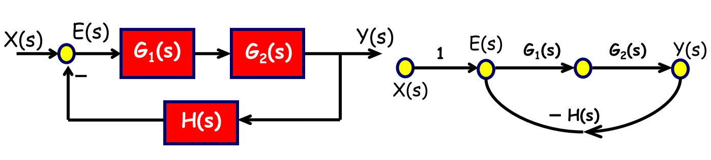

# Chapter 2

## 2-1 Transfer Function and Impulse Response Function

### Transfer Function

The *transfer function* of a linear, time-invariant, differential equation system defined as the **ratio** of the **Laplace transform of the output** to the **Laplace transform of the input** under the assumption that all initial conditions are zero

Consider the linear time-invariant system defined by the following differential equation

$$
\begin{aligned}
    a_0 y^{(n)}+a_1y^{(n-1)}&+\cdots+a_{n-1}\dot{y}+a_n y\\[2ex]
    &=b_0x^{(m)}+b_1x^{(m-1)}+\cdots+b_{m-1}\dot{x}+b_m x
\end{aligned}
$$

where $y$ is the output of the system and $x$ is the input

$$
\begin{aligned}
    \text{Transfer Function} &= G(s) = \frac{\mathscr{L}[\text{output}]}{\mathscr{L}[\text{input}]}\Bigg |_{\text{zero initial conditions}}\\[2ex]
    &= \frac{Y(s)}{X(s)} = \frac{b_0 s^m+b_1s^{m-1}+\cdots+b_{m-1}s+b_m}{a_0 s^n+a_1s^{n-1}+\cdots+a_{n-1}s+a_n}=\frac{N(s)}{D(s)}
\end{aligned}
$$

>1. the concept of transfer function is only appropriate to the LTI system
>2. transfer function is only determined by the structure and parameter of system
>3. if the highest power of $s$ in the **denominator** of the TF is equal to $n$, the system is called as **n-th system**

- **characteristic polynomial**: the denominator polynomial $D(s)$
- **characteristic equation**: the formula of $D(s) = 0$
- **zeros**: the roots of the **numerator polynomial** $N(s)$
- **poles**: the roots of the **denominator polynomial** $D(s)$

### Example

$$
G(s) = \frac{K(2s+1)}{s(3s+1)(T^2s^2+2\xi Ts+1)}
$$

which could be rewritten as

$$
G(s)= K\cdot \frac{1}{s}\cdot(2s+1)\cdot \frac{1}{3s+1}\cdot\frac{1}{T^2s^2+2\xi Ts+1}
$$

- $K$: gain factor
- $1/s$: integral factor
- $2s+1$: first-order differential factor (differential factor)
- $1/(3s+1)$: inertial element (reciprocal first-order)
- $1/(T^2s^2+2\xi Ts+1)$: quadratic factor

## 2-2 Automatic Control Systems

### Block Diagrams

A block diagram of a system is a pictorial representation of the functions performed by each component and of the flow of signals. Such a diagram depicts the interrelationships that exist among the various components.

- **signal line**: a line with arrow that indicate the direction of signal transform
- **block**: it expresses the transfer function
- **summing point**: a circle with a cross is the symbol that indicates a summing operation
- **branch point**: a point from which the signal from a block goes concurrently to other blocks or summing points

### Block Diagram of a Closed-Loop System

$$
\begin{aligned}
    C(s) &= G(s)E(s)\\[2ex]
    E(s) &= R(s)-B(s)\\[2ex]
         &= R(s)-H(s)C(s)\\[2ex]
\end{aligned}
$$

Eliminating $E(s)$ from the equations above

$$
C(s) = G(s)[R(s)-H(s)C(s)]
$$

or

$$
\frac{C(s)}{R(s)} = \frac{G(s)}{1+G(s)H(s)}
$$

### Reduce Block Diagrams

#### Cascaded Systems

$$
\frac{C(s)}{R(s)} = G_1(s)G_2(s)
$$

#### Parallel Connected System

$$
\frac{C(s)}{R(s)} = G_1(s)+G_2(s)
$$

#### Feedback System

##### Negative Feedback System

$$
\frac{C(s)}{R(s)} = \frac{G_1(s)}{1+G_1(s)G_2(s)}
$$

##### Positive Feedback System

$$
\frac{C(s)}{R(s)} = \frac{G_1(s)}{1-G_1(s)G_2(s)}
$$

#### Slide a Summing Point

##### Backward

##### Forward

#### Slide a Branch Point

##### Backward

##### Forward

#### Interchanging the Neighboring

##### Summing Points

##### Branch Points

### Closed-Loop System Subjected to a Disturbance

We could calculate the response $C_D(s)$ to the disturbance only

$$
\frac{C_D(s)}{D(s)} = \frac{G_2(s)}{1+G_1(s)G_2(s)H(s)}
$$

and the response to the reference input $R(s)$

$$
\frac{C_R(s)}{R(s)} = \frac{G_1(s)G_2(s)}{1+G_1(s)G_2(s)H(s)}
$$

Then the response could be the sum of two responses

$$
\begin{aligned}
    C(s) &= C_D(s)+C_R(s)\\[2ex]
         &= \frac{G_2(s)}{1+G_1(s)G_2(s)H(s)}[G_1(s)R(s)+D(s)]
\end{aligned}
$$

## 2-3 Signal-Flow Graph Models

A signal-flow graph is a specialized flow graph, a directed graph in which nodes represent system variables, and branches represent functional connections between pairs of nodes.

### Basic Components

- **node**: represents a signal
  - input nodes: nodes with only outgoing branches
  - output nodes: nodes with only incoming branches
  - mixed nodes: nodes with both incoming and outgoing branches
- **branch**: directed line segment connecting two nodes
  - signal can only flow along the specified direction
  - each branch is associated with a gain, which is the transfer function
- **path**: a sequence of connected branches
  - forward path: start from an input node and end at and output node
  - forward path gain: product of all branch gains along a forward path
- **loop**: a closed path
  - loop gain: product of all branch gains along a lop
  - nontouching loop: loops that do not have shard nodes
  - touching loop: more than one loop sharing one orr more common nodes

### Mason's Gain Formula

$$
G(s) =\frac{C(s)}{R(s)} = \frac{1}{\Delta}\sum_{k=1}^{n}{P_k\Delta_k}
$$

- $\Delta$: determinant of the graph

$$
\Delta = 1-(\text{sum of all individual loop gains})+(\text{sum of gain products of all two nontouching loop})\\[2ex]-(\text{sum of gain products of all three nontouching loop})+\cdots
$$

- $P_k$: path gain of kth forward path
- $\Delta_k$: factor of the kth forward path