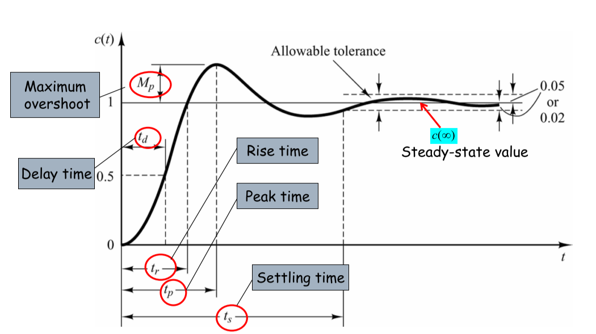
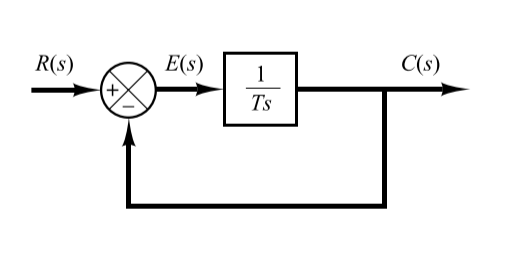
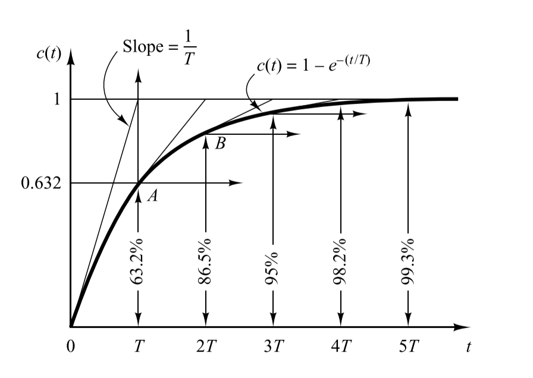
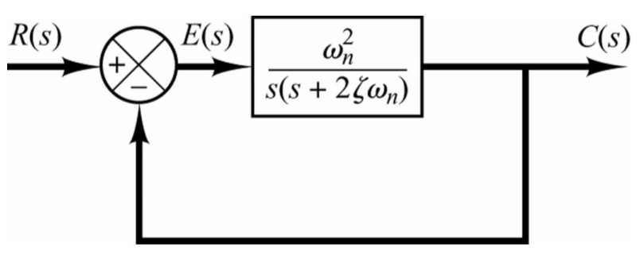
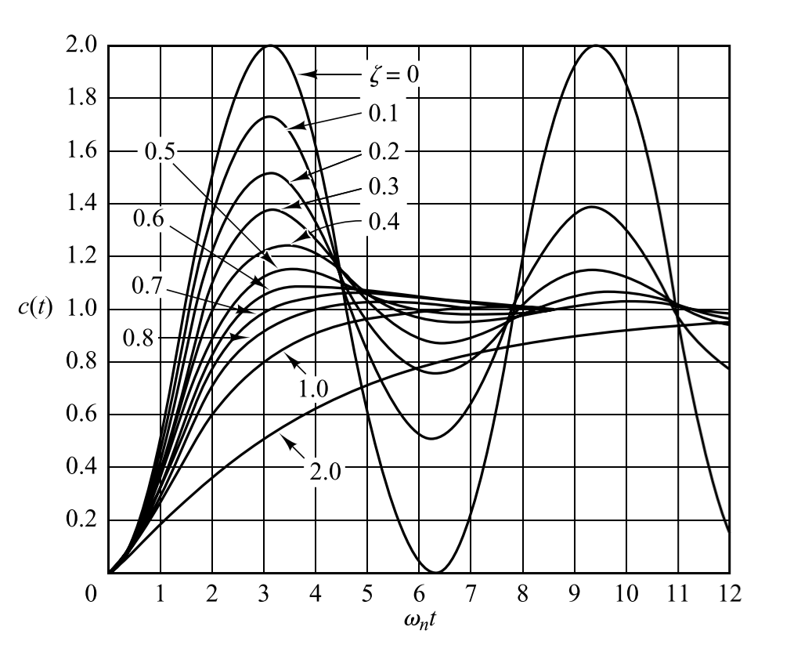

# Chapter 3

## 3-1 Transient and Steady-State Response Analysis

The time response of a control system consists of two parts: the transient response and the steady-state response

- **transient response**: goes from the initial state to the final state
- **steady-state response**: the manner in which the system output behaves as $t\to\infty$

$$
y(t) = \mathscr{L}^{-1}\Big[G(s)H(s)\Big]=y_t(t)+y_s(t)
$$

in other words

$$
\text{time response}=\text{transient response}+\text{steady-state response}
$$

### Transient Response

The transient performance could be measured in terms of the transient response to a unit-step input, and there are some specifications 

- $t_d$: **delay time**, the time of the response to reach half the final value
- $t_r$: **rise time**, the time of the response rise from $10\%$ to $90\%$ or $0\%$ to $100\%$ of its final value
- $t_p$: **peak time**, the time required for the response to reach the first peak of the overshoot
- $t_s$: **setting time**, the time required for the response curve to reach and stay within a range about the final value of size specified by absolute percentage of the final value (usually $5\%$ or $2\%$)
- $\sigma\%$: **maximum overshoot**, it is defined by $[c(t_p)-c(\infty)]/c(\infty)\times 100\%$

> **Response speed** is measured by rise time, delay time and setting time
> **Relative stability** is measured by percent overshoot

And there could also be error after the transient response has delayed, leaving only the continuous response

$$
e_{ss} = \lim_{t\to\infty}{e(t)} = e(\infty)
$$

## 3-2 First-Order Systems

Consider the first-order system in the figure above, the input-output relationship is given by

$$
\frac{C(s)}{R(s)} = \frac{1}{Ts+1}
$$

### Unit-Step Response of First-Order Systems

Since the Laplace transform of the unit step function is $1/s$, the unit step response of the system is

$$
C(s) = \frac{1}{Ts+1}\frac{1}{s}=\frac{1}{s}-\frac{1}{s+(1/T)}
$$

Taking the inverse Laplace transform, we could obtain that

$$
c(t) = 1 - e^{-t/T}
$$

- $1$: steady-state response
- $e^{-t/T}$: transient response
  

- Steady-State Error is 0
- Setting time is about 3T to 4T
- Smaller the time constant T is, the faster the system response

## 3-3 Second-Order Systems

$$
G(s) = \frac{\omega_n^2}{s^2+2\zeta\omega_n s+\omega_n^2}
$$

- $\omega_n$: undamped natural frequency
- $\zeta$: damping ratio

which has the characteristic equation of 

$$
s^2+2\zeta \omega_n s+\omega_n^2=0
$$

and the closed loop poles

$$
s_{1,2} = -\zeta \omega_n\pm\omega_n\sqrt{\zeta^2-1}
$$

| Classifications of second order systems | The number of $\zeta$ |
| :-------------------------------------: | :-------------------: |
|             Overdamped Case             |       $\zeta>1$       |
|         Critically Damped Case          |       $\zeta=1$       |
|            Underdamped Case             |      $0<\zeta<1$      |
|          Undamped Damped Case           |       $\zeta=0$       |

### Overdamped Case

Since the poles are

$$
s_{1,2} = -\zeta\omega_n\pm\omega_n\sqrt{\zeta_2-1}
$$

which means they are all real

And the output gives the following response

$$
c(t) = 1+\frac{1}{\frac{s_1}{s_2}-1}e^{s_1t}+\frac{1}{\frac{s_2}{s_1}-1}e^{s_2t}
$$

which includes two delaying exponential terms

> If $s_1$ is located very much closer to the $j\omega$ asia than $s_2$, then the effect of $s_2$ on the response is much smaller than that of $s_1$, which response is similar to that of a **first-order** system

### Critically Damped Case

The poles become to

$$
s_{1,2} = -\omega_n
$$

And the output gives the following response

$$
C(t) = 1-(1+\omega_n t)e^{-\omega_n t}
$$

### Underdamped Case

There are two complex conjugate poles for this case

$$
s_{1,2} = -\zeta \omega_n \pm j\omega_n\sqrt{1-\zeta^2}
$$

And the unit-step response becomes

$$
c(t) = 1-\frac{e^{-\zeta \omega_n t}}{\sqrt{1-\zeta^2}}\sin(\omega_d t+\beta)
$$

- $\beta$ =  $\arccos(\zeta)$
- damped natural frequency: $\omega_d = \omega_n\sqrt{1-\zeta^2}$

$$
\sigma\% =\frac{y(t_p)-y(\infty)}{y(\infty)}\times 100\% = e^{-\frac{\pi \zeta}{\sqrt{1-\zeta^2}}}
$$

and the setting time of it are

$$
\begin{aligned}
    t_s = \frac{3}{\zeta \omega_n}(\Delta = 0.05)\\[2ex]
    t_s = \frac{4}{\zeta \omega_n}(\Delta = 0.02)\\[2ex]
\end{aligned}
$$

### Undamped Case

There're two poles both on $j\omega$ axis

$$
s_{1,2} = \pm j\omega_n
$$

And the unit-step response is 

$$
c(t) = 1-\cos\omega_nt
$$

**Remarks**

- if two second-order systems have the same $\zeta$ but different $\omega_n$, they will exhibit the same overshoot asn the same oscillatory, which is called to have the **same relative stability**
- underdamped system with $\zeta$ between 0.5 and 0.8 gets close to the final value more rapid ly than a critically or overdamped system
- overdamped system is always sluggish in responding to any inputs