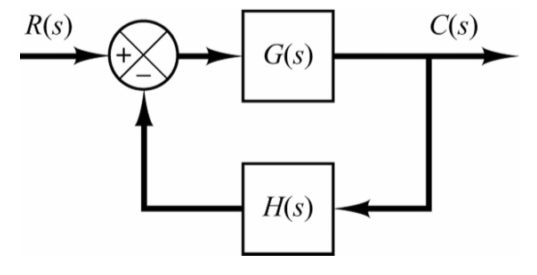
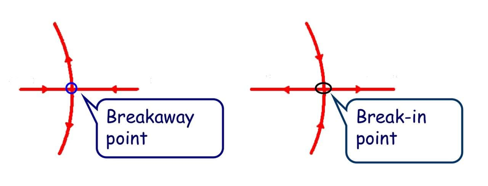

# Chapter 4 Root Locus

## 4-1 Introduction of the Root Locus Method

Taking the system in the following figure into consideration, we want to figure out that how do the characteristic roots change according to the different values of $k$

The open-loop transfer function is

$$
G(s) = \frac{k}{s(s+2)}
$$

And the characteristic equation of the closed-loop system is

$$
1+G(s) = 1+\frac{k}{s(s+2)}=0\Longrightarrow s^2+2s+k = 0
$$

And the roots of the characteristic equation are

$$
s_1 = -1+\sqrt{1-k}\qquad s_2=-1-\sqrt{1-k}
$$

And the analysis of the roots are

$$
\begin{aligned}
s_{1,2} = -1\pm\sqrt{1-k}\qquad
\begin{cases}
    s_1 = 0 \quad s_2 = -2\qquad &k=0\\[2ex]
    \text{Real and different}\qquad &0<k<1\\[2ex]
    s_1 = s_2 = -1\qquad &k=1\\[2ex]
    s_{1,2} = -2\pm j\sqrt{k-1}\qquad &k>1
\end{cases}
\end{aligned}
$$

We could sketch the locus of the roots varying with $k$ from $0$ to $\infty$ on the s-plane

The following words introduce the definition of the **root locus**

The path of the **roots of the characteristic equation** traced out in the s-plane as a system parameter is changed

We could use the root locus to determine the system performance

- stability: the system is always stable since all of the poles lie in the left-half of s-plane
- transient performance:
  - $0<k<1$: overdamped case
  - $k=1$: critically damped case
  - $k>1$: underdamped case
- steady-state performance: type 1 system

## 4-2 The Root-Locus Equation

Consider the following negative feedback system

The characteristic equation of the system is

$$
1+G(s)H(s) = 0
$$

Where $G(s)H(s)$ could be rewritten as

$$
G(s)H(s) = \frac{K\prod_{i=1}^m(s+z_i)}{\prod_{j=1}^n(s+p_j)}=-1
$$

The equation above is also called a the **root locus equation**

and could be expanded into other two conditions

$$
\begin{cases}
    K\frac{\prod_{i=1}^m|(s+z_i)|}{\prod_{i=1}^n|(s+p_i)|}=1\qquad &\text{Magnitude Condition}\\[2ex]
    \sum_{i=1}^m\angle{(s+z_i)}-\sum_{j=1}^n\angle{(s+p_j)}=\pm(2k+1)\pi &\text{Angle Condition}
\end{cases}
$$

- Magnitude Condition: the condition is used to determine the value of K for a given root location
- Angle Condition: the condition for a point $s$ which is on the root locus

## 4-3 General Rules for Sketching Root Locus Plot

### Prepare Rules

1. The characteristic equation $1+G(s)H(s)=0$ should be written in the very beginning
2. Factor the equation into the form of poles and zeros
3. Locate the poles and zeros of the equation in s-plane with specified symbols
   - x: poles
   - o: zeros
   
### 1 - Beginning and Ending Points

The locus of the roots of the characteristic equation begins at **poles** and ends at **zeros**

If the number of the open-loop zeros $m$ is less than the number of the open-loop poles $n$, then there're $n-m$ root loci **terminating at the infinity**

### 2 - Number and Symmetry

The number of loci is **equal to** the number of open loop poles

The root locus is **continuous** and **symmetrical** with respect to the real axis

### 3 - Loci on Real Axis

The root locus on the real axis always lies in a section of the real axis where there are **odd numbers of poles and zeros to the right**

### 4 - Asymptotes

The root locus proceed to the infinity along asymptotes **centered** at $\sigma_A$ with **angles** of $\phi_A$

$$
\begin{aligned}
	\sigma_A &= \frac{\sum_{i=1}^n(\text{pole}_i)-\sum_{i=1}^m(\text{zero}_i)}{n-m}\\[2ex]
	\phi_A &= \frac{(2k+1)\pi}{n-m}
\end{aligned}
$$

### 5 - Breakaway and Break-in Points on the Axis

The breakaway or break-in points correspond to multiple roots of the characteristic equation

$$
G(s)H(s) = \frac{K\prod_{i=1}^m(s+z_i)}{\prod_{i=1}^n(s+p_i)} = \frac{KN(s)}{D(s)}=-1
$$

The points could be find by

$$
\begin{aligned}
	\begin{cases}
		\frac{\mathrm{d}K}{\mathrm{d}s} = 0\\[2ex]
		K = -\frac{D(s)}{N(s)}
	\end{cases}
	\Longrightarrow
	\frac{\mathrm{d}K}{\mathrm{d}s}= -\frac{D'(s)N(s)-D(s)N'(s)}{N(s)^2}
\end{aligned}
$$

### 6 - Departure Angle and Arrival Angle

According to the angle condition, the angles of departure or arrival could vary in different conditions

- Angle of Departure: $180\degree - (\sum{\text{angles of the vectors from other poles to the pole}}-\sum{\text{angles of the vectors from other zeros to the pole}})$
- Angle of Arrival: $180\degree - (\sum{\text{angles of the vectors from other zeros to the pole}}-\sum{\text{angles of the vectors from other poles to the pole}})$

### 7 - Crossing Points with the Imaginary Axis

The points where the root loci intersect the imaginary axis can be found by letting $s=j\omega$ in the **characteristic equation**, equating both **real part** and **imaginary part** to **zero**

### 8 - Sum of the Roots

If the number of poles is larger than the number of the poles, where $n-m \geq 2$, the sum of the roots **remains a constant**