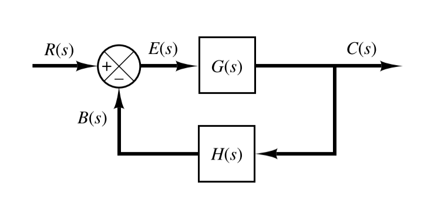
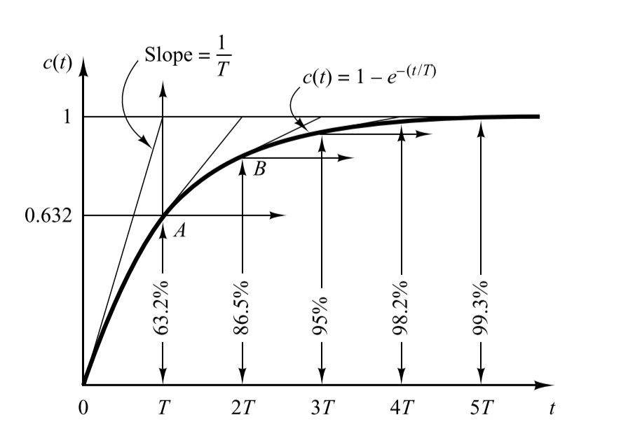
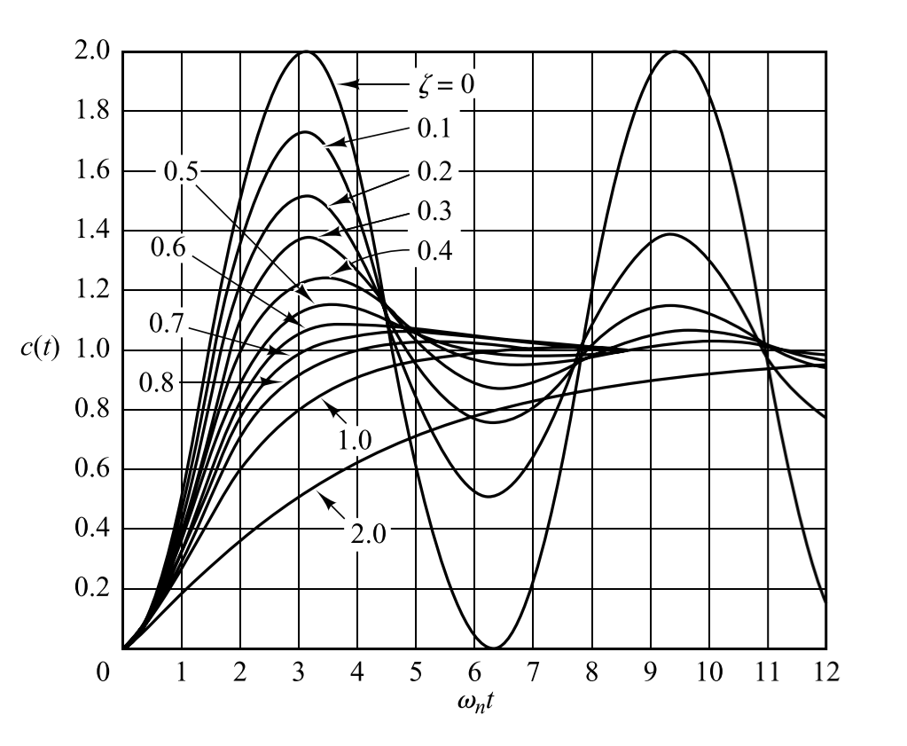
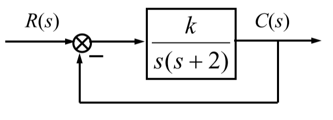
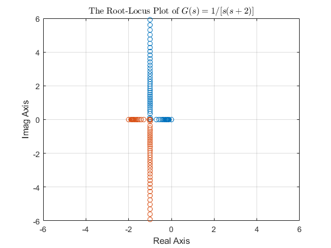

# Control Theory

# Chapter 1 Introduction

## 1-1 Basic Terms and Concepts

- **Reference Components**: a reference component generates the reference signal or the input signal
- **Controlled Variable**: the quantity or condition that is measured and controlled
- **Comparison Components**: compare the input with feedback signal and generate the error signal
- **Plant** or Process: any physical object or operation to be controlled
- **Controller**: a compensation component, improves the performance ofg the system
- **Actuator**: acts on that plant directly to adjust the controlled variable
- **Disturbance**: a signal that tends to adversely affect the value of the output of a system
- **Sensor** or measurement component: measure the output or the controlled variable and generate feedback signal

### Examples

|               Control System                |      Plant       |   Controlled Variable   |
| :-----------------------------------------: | :--------------: | :---------------------: |
|  |    water tank    |       water level       |
|   | electric furnace | the furnace temperature |

## 1-2 Types of Control

### Open-loop Control Systems

An open-loop system is a system without feed back

- the output of the open-loop system has no effect upon the input signal
- there is only forward action from the input to the output

#### Advantages

- simple construction and ease of maintenance
- less expensive
- no stability problem
- convenient when output is hard to measure

#### Disadvantages

- disturbance and changes in calibration cause errors
- to maintain the required quality in the output, recalibration is necessary from time to time

### Closed-loop Control System

A closed-loop control system uses a measurement of the output and feedback of this signal to compare it with the desired output

#### Features

- there are feedbacks in the system so that signals flow through closed loops
- the error signal controls the system

## General Requirements for Control Systems

- **Stability**: stability, smooth and steady
- **Swiftness**: peak time, settling time
- **Accuracy**: steady-state error

### Stable and Unstable

|Stable|Unstable|
|:--:|:--:|
|||
|||

### Regulation Process

The whole regulation process can be divided into two stages

**transient process** + **steady-state process**

- **transient process** reflects dynamic characteristics
- **steady-state process** reflects steady-state characteristics

#### Transient Response

- **swiftness**: peak time, settling time

#### Steady-State Response

- **accuracy**: steady-state error

# Chapter 2 Transfer Function and Block Diagram

## 2-1 Transfer Function and Impulse Response Function

### Transfer Function

The *transfer function* of a linear, time-invariant, differential equation system defined as the **ratio** of the **Laplace transform of the output** to the **Laplace transform of the input** under the assumption that all initial conditions are zero

Consider the linear time-invariant system defined by the following differential equation

$$
\begin{aligned}
    a_0 y^{(n)}+a_1y^{(n-1)}&+\cdots+a_{n-1}\dot{y}+a_n y\\[2ex]
    &=b_0x^{(m)}+b_1x^{(m-1)}+\cdots+b_{m-1}\dot{x}+b_m x
\end{aligned}
$$

where $y$ is the output of the system and $x$ is the input

$$
\begin{aligned}
    \text{Transfer Function} &= G(s) = \frac{\mathscr{L}[\text{output}]}{\mathscr{L}[\text{input}]}\Bigg |_{\text{zero initial conditions}}\\[2ex]
    &= \frac{Y(s)}{X(s)} = \frac{b_0 s^m+b_1s^{m-1}+\cdots+b_{m-1}s+b_m}{a_0 s^n+a_1s^{n-1}+\cdots+a_{n-1}s+a_n}=\frac{N(s)}{D(s)}
\end{aligned}
$$

>1. the concept of transfer function is only appropriate to the LTI system
>2. transfer function is only determined by the structure and parameter of system
>3. if the highest power of $s$ in the **denominator** of the TF is equal to $n$, the system is called as **n-th system**

- **characteristic polynomial**: the denominator polynomial $D(s)$
- **characteristic equation**: the formula of $D(s) = 0$
- **zeros**: the roots of the **numerator polynomial** $N(s)$
- **poles**: the roots of the **denominator polynomial** $D(s)$

### Example

$$
G(s) = \frac{K(2s+1)}{s(3s+1)(T^2s^2+2\xi Ts+1)}
$$

which could be rewritten as

$$
G(s)= K\cdot \frac{1}{s}\cdot(2s+1)\cdot \frac{1}{3s+1}\cdot\frac{1}{T^2s^2+2\xi Ts+1}
$$

- $K$: gain factor
- $1/s$: integral factor
- $2s+1$: first-order differential factor (differential factor)
- $1/(3s+1)$: inertial element (reciprocal first-order)
- $1/(T^2s^2+2\xi Ts+1)$: quadratic factor

## 2-2 Automatic Control Systems

### Block Diagrams

A block diagram of a system is a pictorial representation of the functions performed by each component and of the flow of signals. Such a diagram depicts the interrelationships that exist among the various components.

- **signal line**: a line with arrow that indicate the direction of signal transform
- **block**: it expresses the transfer function
- **summing point**: a circle with a cross is the symbol that indicates a summing operation
- **branch point**: a point from which the signal from a block goes concurrently to other blocks or summing points

### Block Diagram of a Closed-Loop System

$$
\begin{aligned}
    C(s) &= G(s)E(s)\\[2ex]
    E(s) &= R(s)-B(s)\\[2ex]
         &= R(s)-H(s)C(s)\\[2ex]
\end{aligned}
$$

Eliminating $E(s)$ from the equations above

$$
C(s) = G(s)[R(s)-H(s)C(s)]
$$

or

$$
\frac{C(s)}{R(s)} = \frac{G(s)}{1+G(s)H(s)}
$$

### Reduce Block Diagrams

#### Cascaded Systems

$$
\frac{C(s)}{R(s)} = G_1(s)G_2(s)
$$

#### Parallel Connected System

$$
\frac{C(s)}{R(s)} = G_1(s)+G_2(s)
$$

#### Feedback System

##### Negative Feedback System

$$
\frac{C(s)}{R(s)} = \frac{G_1(s)}{1+G_1(s)G_2(s)}
$$

##### Positive Feedback System

$$
\frac{C(s)}{R(s)} = \frac{G_1(s)}{1-G_1(s)G_2(s)}
$$

#### Slide a Summing Point

##### Backward

##### Forward

#### Slide a Branch Point

##### Backward

##### Forward

#### Interchanging the Neighboring

##### Summing Points

##### Branch Points

### Closed-Loop System Subjected to a Disturbance

We could calculate the response $C_D(s)$ to the disturbance only

$$
\frac{C_D(s)}{D(s)} = \frac{G_2(s)}{1+G_1(s)G_2(s)H(s)}
$$

and the response to the reference input $R(s)$

$$
\frac{C_R(s)}{R(s)} = \frac{G_1(s)G_2(s)}{1+G_1(s)G_2(s)H(s)}
$$

Then the response could be the sum of two responses

$$
\begin{aligned}
    C(s) &= C_D(s)+C_R(s)\\[2ex]
         &= \frac{G_2(s)}{1+G_1(s)G_2(s)H(s)}[G_1(s)R(s)+D(s)]
\end{aligned}
$$

## 2-3 Signal-Flow Graph Models

A signal-flow graph is a specialized flow graph, a directed graph in which nodes represent system variables, and branches represent functional connections between pairs of nodes.

### Basic Components

- **node**: represents a signal
  - input nodes: nodes with only outgoing branches
  - output nodes: nodes with only incoming branches
  - mixed nodes: nodes with both incoming and outgoing branches
- **branch**: directed line segment connecting two nodes
  - signal can only flow along the specified direction
  - each branch is associated with a gain, which is the transfer function
- **path**: a sequence of connected branches
  - forward path: start from an input node and end at and output node
  - forward path gain: product of all branch gains along a forward path
- **loop**: a closed path
  - loop gain: product of all branch gains along a lop
  - nontouching loop: loops that do not have shard nodes
  - touching loop: more than one loop sharing one orr more common nodes

### Mason's Gain Formula

$$
G(s) =\frac{C(s)}{R(s)} = \frac{1}{\Delta}\sum_{k=1}^{n}{P_k\Delta_k}
$$

- $\Delta$: determinant of the graph

$$
\Delta = 1-(\text{sum of all individual loop gains})+(\text{sum of gain products of all two nontouching loop})\\[2ex]-(\text{sum of gain products of all three nontouching loop})+\cdots
$$

- $P_k$: path gain of kth forward path
- $\Delta_k$: factor of the kth forward path

# Chapter 3 Steady-State and Stability Analysis

## 3-1 Transient and Steady-State Response Analysis

The time response of a control system consists of two parts: the transient response and the steady-state response

- **transient response**: goes from the initial state to the final state
- **steady-state response**: the manner in which the system output behaves as $t\to\infty$

$$
y(t) = \mathscr{L}^{-1}\Big[G(s)H(s)\Big]=y_t(t)+y_s(t)
$$

in other words

$$
\text{time response}=\text{transient response}+\text{steady-state response}
$$

### Transient Response

The transient performance could be measured in terms of the transient response to a unit-step input, and there are some specifications 

- $t_d$: **delay time**, the time of the response to reach half the final value
- $t_r$: **rise time**, the time of the response rise from $10\%$ to $90\%$ or $0\%$ to $100\%$ of its final value
- $t_p$: **peak time**, the time required for the response to reach the first peak of the overshoot
- $t_s$: **setting time**, the time required for the response curve to reach and stay within a range about the final value of size specified by absolute percentage of the final value (usually $5\%$ or $2\%$)
- $\sigma\%$: **maximum overshoot**, it is defined by $[c(t_p)-c(\infty)]/c(\infty)\times 100\%$

> **Response speed** is measured by rise time, delay time and setting time
> **Relative stability** is measured by percent overshoot

And there could also be error after the transient response has delayed, leaving only the continuous response

$$
e_{ss} = \lim_{t\to\infty}{e(t)} = e(\infty)
$$

## 3-2 First-Order Systems

Consider the first-order system in the figure above, the input-output relationship is given by

$$
\frac{C(s)}{R(s)} = \frac{\frac{1}{Ts}}{1+\frac{1}{Ts}} = \frac{1}{Ts}
$$

### Unit-Step Response of First-Order Systems

Since the Laplace transform of the unit step function is $1/s$, the unit step response of the system is

$$
C(s) = \frac{1}{Ts+1}\frac{1}{s}=\frac{1}{s}-\frac{1}{s+(1/T)}
$$

Taking the inverse Laplace transform, we could obtain that

$$
c(t) = 1 - e^{-t/T}
$$

- $1$: steady-state response
- $e^{-t/T}$: transient response
  

- Steady-State Error is 0
- Setting time is about 3T to 4T
- Smaller the time constant T is, the faster the system response

## 3-3 Second-Order Systems

$$
G(s) = \frac{\omega_n^2}{s^2+2\zeta\omega_n s+\omega_n^2}
$$

- $\omega_n$: undamped natural frequency
- $\zeta$: damping ratio

which has the characteristic equation of 

$$
s^2+2\zeta \omega_n s+\omega_n^2=0
$$

and the closed loop poles

$$
s_{1,2} = -\zeta \omega_n\pm\omega_n\sqrt{\zeta^2-1}
$$

| Classifications of second order systems | The number of $\zeta$ |
| :-------------------------------------: | :-------------------: |
|             Overdamped Case             |       $\zeta>1$       |
|         Critically Damped Case          |       $\zeta=1$       |
|            Underdamped Case             |      $0<\zeta<1$      |
|          Undamped Damped Case           |       $\zeta=0$       |

### Overdamped Case

Since the poles are

$$
s_{1,2} = -\zeta\omega_n\pm\omega_n\sqrt{\zeta_2-1}
$$

which means they are all real

And the output gives the following response

$$
c(t) = 1+\frac{1}{\frac{s_1}{s_2}-1}e^{s_1t}+\frac{1}{\frac{s_2}{s_1}-1}e^{s_2t}
$$

which includes two delaying exponential terms

> If $s_1$ is located very much closer to the $j\omega$ asia than $s_2$, then the effect of $s_2$ on the response is much smaller than that of $s_1$, which response is similar to that of a **first-order** system

### Critically Damped Case

The poles become to

$$
s_{1,2} = -\omega_n
$$

And the output gives the following response

$$
C(t) = 1-(1+\omega_n t)e^{-\omega_n t}
$$

### Underdamped Case

There are two complex conjugate poles for this case

$$
s_{1,2} = -\zeta \omega_n \pm j\omega_n\sqrt{1-\zeta^2}
$$

And the unit-step response becomes

$$
c(t) = 1-\frac{e^{-\zeta \omega_n t}}{\sqrt{1-\zeta^2}}\sin(\omega_d t+\beta)
$$

- $\beta$ =  $\arccos(\zeta)$
- damped natural frequency: $\omega_d = \omega_n\sqrt{1-\zeta^2}$

$$
\sigma\% =\frac{y(t_p)-y(\infty)}{y(\infty)}\times 100\% = e^{-\frac{\pi \zeta}{\sqrt{1-\zeta^2}}}
$$

and the setting time of it are

$$
\begin{aligned}
    t_s = \frac{3}{\zeta \omega_n}(\Delta = 0.05)\\[2ex]
    t_s = \frac{4}{\zeta \omega_n}(\Delta = 0.02)\\[2ex]
\end{aligned}
$$

### Undamped Case

There're two poles both on $j\omega$ axis

$$
s_{1,2} = \pm j\omega_n
$$

And the unit-step response is 

$$
c(t) = 1-\cos\omega_nt
$$

**Remarks**

- if two second-order systems have the same $\zeta$ but different $\omega_n$, they will exhibit the same overshoot asn the same oscillatory, which is called to have the **same relative stability**
- underdamped system with $\zeta$ between 0.5 and 0.8 gets close to the final value more rapid ly than a critically or overdamped system
- overdamped system is always sluggish in responding to any inputs

## 3-5 Stability Analysis of the n-th Order Systems

$$
\frac{C(s)}{R(s)} = \frac{b_m s^m+b_{m-1}s^{m-1}+\cdots+b_1 s+b_0}{a_n s^n+a_{n-1}s^{n-1}+\cdots+a_1 s+a_0}=\frac{N(s)}{D(s)}
$$

For the unit step response

$$
C(s) = R(s)G(s) = \frac{1}{s}\frac{N(s)}{D(s)}=\frac{K\prod_{i=1}^m(s+z_i)}{\prod_{j=1}^q(s+p_j)\prod_{k=1}^r(s+\alpha_k)^2+\beta_k^2}
$$

In the time domain

$$
c(t) = a+\sum_{j=1}^q{b_j e^{-p_j t}}+\sum_{k=1}^r{A_ke^{-\alpha_k t}}\sin(\beta_k t+\theta_k)
$$

- real poles contribute exponential terms
- complex pair of poles contribute damped oscillations
- magnitude of contribution depends on residues

### Stability of System Response

The transient term will converge to zero if and only if **all poles** are on the **left-hand of plains** (LHP), and the further to the left on the LHP for the poles, the faster the convergence.

#### Method 1: Direct Factorization

Solve for solutions of characteristic equation

$$
a_0s^n+a_1s^{n-1}+\cdots+a_{n-1}s+a_n=0
$$

and check if all of them are on the LHP

#### Method 2: Routh's Stability Criterion

Determine the locations of roots without having to solve the equation

- step 1: determine if all the coefficients of the characteristic equation **have the same sign** and are **nonzero** or it is unstable
- step 2: if all coefficients are positive, arrange all coefficients in rows and columns to the following pattern, construct the Routh table

| power of s |             column 1              |             column 2              | column 3 | $\cdots$ |
| :--------: | :-------------------------------: | :-------------------------------: | :------: | :------: |
|   $s^n$    |               $a_0$               |               $a_2$               |  $a_4$   | $\cdots$ |
| $s^{n-1}$  |               $a_1$               |               $a_3$               |  $a_5$   | $\cdots$ |
| $s^{n-2}$  |  $b_1=\frac{a_1a_2-a_0a_3}{a_1}$  | $b_2 = \frac{a_1a_4-a_0a_5}{a_1}$ | $\cdots$ | $\cdots$ |
| $s^{n-3}$  |  $c_1=\frac{b_1a_3-a_1b_2}{b_1}$  |             $\cdots$              | $\cdots$ | $\cdots$ |
|  $\vdots$  |             $\vdots$              |             $\cdots$              | $\vdots$ | $\vdots$ |
|   $s^2$    |               $e_1$               |               $e_2$               |          |          |
|   $s^1$    |               $f_1$               |                $0$                |          |          |
|   $s^0$    | $g=\frac{f_1e_2-e_1\cdot 0}{f_1}$ |                                   |          |          |

##### Special Case 1

If the first element in any row of Rough's array is zero, but the others are not.

The zero element in the first column should be replaced by small positive number of $\epsilon$, then proceed with Rough's array

$$
s^3+2s^2+s+2 = 0
$$

the array of coefficients is

$$
\begin{aligned}
    s^4 &\quad 1\quad 1\quad 1\\[2ex]
    s^3 &\quad 2\quad 2\\[2ex]
    s^2 &\quad \varepsilon>0\quad 1\\[2ex]
    s^1 &\quad 2-\frac{2}{\varepsilon}\\[2ex]
    s^0 &\quad 1
\end{aligned}
$$

##### Special Case 2

An entire row of the Rough array may become zero, which indicates that there are roots of equal magnitude lying radially opposite in the s-plane

The situation can be remedied by forming an **auxiliary polynomial** with the coefficients of the last row.

$$
s^6+2s^5+7s^4+12s^3+14s^2+16s+8=0
$$

the array of coefficients is

$$
\begin{aligned}
    s^6 &\quad 1 \quad 7 \quad 14 \quad 8\\[2ex]
    s^5 &\quad 2 \quad 12 \quad 16 \quad 0\\[2ex]
    s^4 &\quad 1 \quad 6 \quad 8\\[2ex]
    s^3 &\quad 0 \quad 0 \quad 0\\[2ex]
    s^3 &\quad 4 \quad 12\\[2ex]
    s^2 &\quad 3 \quad 8\\[2ex]
    s^1 &\quad 4/3\\[2ex]
    s^0 &\quad 8
\end{aligned}
$$

the auxiliary polynomial is

$$
\begin{aligned}
    p(s) &= s^4+6s^2+8\\[2ex]
    \frac{\mathrm{d}p(s)}{\mathrm{d}s} &= 4s^3+12s
\end{aligned}
$$

##### Relative Stability Analysis

Apply Rough's stability criterion to the shifted s-palne axis

Substitute $s=z-\sigma$ into the Rough's stability criterion

#### Useful Tips for Stability

|       System        |          Equation          |                                 Tip                                  |
| :-----------------: | :------------------------: | :------------------------------------------------------------------: |
| First order system  |        $a_0s+a_1=0$        |                  $a_1$ and $a_0$ have the same sign                  |
| Second order system |    $a_0s^2+a_1s+a_2=0$     |              $a_2$, $a_1$ and $a_0$ have the same sign               |
| Third order system  | $a_0s^3+a_1s^2+a_2s+a_3=0$ | $a_3$, $a_2$, $a_1$ and $a_0$ have the same sign and $a_1a_2>a_0a_3$ |

## 3-6 Steady-State Errors in Feedback

$$
e(t) = r(t)-b(t)
$$

- $e(t)$: error
- $r(t)$: reference input
- $b(t)$: feedback signal

Since the transfer function from the input or the disturbance to the error signal is

$$
\Phi_e(s) = \frac{E(s)}{R(s)}\qquad \Phi_{en}(s)=\frac{E(s)}{N(s)}
$$

Using the final value theorem to obtain the steady-state error

$$
e_{ss} = \lim_{s\to 0}s[\Phi_e(s)R(s)+\Phi_{en}(s)N(s)]
$$

The **steady-state error** is defined as

$$
e_{ss} = \lim_{t\to\infty}e(t)= \lim_{s\to 0}sE(s) = \lim_{s\to 0}s\Phi_e(s)R(s) = \lim_{s\to0}s\cdot\frac{1}{1+G(s)H(s)}\cdot R(s)
$$

> All roles of $sE(s)$ must lie on the left-half of the s-plane, which means the system is stable

### Classification of Control Systems

Consider a feed back control system with following open-loop transfer function

$$
G(s)H(s) = \frac{K_k\prod_{i=1}^m(T_is+1)}{s^N \prod_{j=1}^{n-N}(T_j s+1)}
$$

- $K_k$: open-loop gain
- $N$: the number of integrations

| the number of N | the system integration |
| :-------------: | :--------------------: |
|        0        |     type 0 system      |
|        1        |     type 1 system      |
|        2        |     type 2 system      |

### Steady-State Errors in Unity-Feedback Control Systems

$$
e(t) = r(t)-c(t)
$$

The **steady-state error** is defined as

$$
e_{ss} = \lim_{t\to\infty}e(t) =  \lim_{s\to 0}sE(s) =\lim_{s\to0}\frac{sR(s)}{1+G(s)}
$$

#### Unit-Step Input

The input signal is the unit-step signal, where $R(s)=\frac{1}{s}$

$$
e_{ss} = \lim_{s\to 0} sE(s) = \lim_{s\to 0}s\Phi_e(s)R(s)=s\cdot \frac{1}{1+G(s)} \cdot \frac{1}{s} = \frac{1}{1+\lim_{s\to 0}G(s)}=\frac{1}{1+K_p}
$$

> $K_p = \lim_{s\to 0}G(s)$, which is defined as the static position error constant

##### Type 0 System

For the type 0 system, there is no difference between static position error constant

$$
K_p = K_k
$$

Therefore, the steady-state error becomes to

$$
e_{ss} = \frac{1}{1+K_k}
$$

##### Type 1 System

According to the definition of the static position error constant

$$
K_p = \lim_{s\to 0} \frac{K_k\prod_{i=1}^m(T_is+1)}{s \prod_{j=1}^{n-N}(T_j s+1)} = \infty
$$

Then the steady-state error becomes to

$$
e_{ss} = 0
$$

##### Type 2 System

Similar to the type 1 system

$$
K_p = \infty \qquad e_{ss} =0
$$

#### Unit-Ramp Input

The input signal is the unit-stamp signal, where $R(s) = \frac{1}{s^2}$

$$
e_{ss} = \lim_{s\to 0} sE(s) = \lim_{s\to 0}s\Phi_e(s)R(s)=\lim_{s\to 0}s\cdot \frac{1}{1+G(s)} \cdot \frac{1}{s^2} = \lim_{s\to 0}\frac{1}{sG(s)} = \frac{1}{K_v}
$$

> $K_v = \lim_{s\to 0}sG(s)$, which is defined as the static velocity error constant

##### Type 0 System

For the type 0 system, the steady-state error becomes to

$$
K_v = \lim_{s\to 0}sG(s) = 0
$$

Therefore, the steady-state error becomes to

$$
e_{ss} = \infty
$$

##### Type 1 System

There is no difference between the 

$$
K_v = K_k
$$

Then the steady-state error becomes to

$$
e_{ss} = \frac{1}{K_k}
$$

##### Type 2 System

$$
K_v = \infty \qquad e_{ss} =0
$$

#### Unit-Parabolic Input

The input signal is the unit-parabolic signal $r(t) = \frac{1}{2}t^2$, where $R(s) = \frac{1}{s^3}$

$$
e_{ss} = \lim_{s\to 0} sE(s) = \lim_{s\to 0}s\Phi_e(s)R(s)=\lim_{s\to 0}s\cdot \frac{1}{1+G(s)} \cdot \frac{1}{s^3} = \lim_{s\to 0}\frac{1}{s^2G(s)} = \frac{1}{K_a}
$$

> $K_a = \lim_{s\to 0}s^2G(s)$, which is defined as the static acceleration error constant

##### Type 0 System

For the type 0 system, the steady-state error becomes to

$$
K_a = \lim_{s\to 0}s^2G(s) = 0
$$

Therefore, the steady-state error becomes to

$$
e_{ss} = \infty
$$

##### Type 1 System

There is no difference between the 

$$
K_a = \lim_{s\to 0}s^2G(s) = 0
$$

Then the steady-state error becomes to

$$
e_{ss} = \infty
$$

##### Type 2 System

$$
K_a = K_k \qquad e_{ss} =\frac{1}{K_k}
$$

| System Type |    Step Input     |   Ramp Input    | Acceleration Input |
| :---------: | :---------------: | :-------------: | :----------------: |
|   Type 0    | $\frac{1}{K_k+1}$ |    $\infty$     |      $\infty$      |
|   Type 1    |         0         | $\frac{1}{K_k}$ |      $\infty$      |
|   Type 2    |         0         |       $0$       |  $\frac{1}{K_k}$   |

### Reduce or Eliminate the Steady State Error

- Method 1: increase the open-loop gain
- Method 2: increase the tpe of the system by adding a integrator or integrators to the feedforward path
- Method 3: feedforward compensation

#### Feedforward Compensation of Input

#### Feedforward Compensation of Disturbance

# Chapter 4 Root Locus

## 4-1 Introduction of the Root Locus Method

Taking the system in the following figure into consideration, we want to figure out that how do the characteristic roots change according to the different values of $k$

The open-loop transfer function is

$$
G(s) = \frac{k}{s(s+2)}
$$

And the characteristic equation of the closed-loop system is

$$
1+G(s) = 1+\frac{k}{s(s+2)}=0\Longrightarrow s^2+2s+k = 0
$$

And the roots of the characteristic equation are

$$
s_1 = -1+\sqrt{1-k}\qquad s_2=-1-\sqrt{1-k}
$$

And the analysis of the roots are

$$
\begin{aligned}
s_{1,2} = -1\pm\sqrt{1-k}\qquad
\begin{cases}
    s_1 = 0 \quad s_2 = -2\qquad &k=0\\[2ex]
    \text{Real and different}\qquad &0<k<1\\[2ex]
    s_1 = s_2 = -1\qquad &k=1\\[2ex]
    s_{1,2} = -2\pm j\sqrt{k-1}\qquad &k>1
\end{cases}
\end{aligned}
$$

We could sketch the locus of the roots varying with $k$ from $0$ to $\infty$ on the s-plane

The following words introduce the definition of the **root locus**

The path of the **roots of the characteristic equation** traced out in the s-plane as a system parameter is changed

We could use the root locus to determine the system performance

- stability: the system is always stable since all of the poles lie in the left-half of s-plane
- transient performance:
  - $0<k<1$: overdamped case
  - $k=1$: critically damped case
  - $k>1$: underdamped case
- steady-state performance: type 1 system

## 4-2 The Root-Locus Equation

Consider the following negative feedback system

The characteristic equation of the system is

$$
1+G(s)H(s) = 0
$$

Where $G(s)H(s)$ could be rewritten as

$$
G(s)H(s) = \frac{K\prod_{i=1}^m(s+z_i)}{\prod_{j=1}^n(s+p_j)}=-1
$$

The equation above is also called a the **root locus equation**

and could be expanded into other two conditions

$$
\begin{cases}
    K\frac{\prod_{i=1}^m|(s+z_i)|}{\prod_{i=1}^n|(s+p_i)|}=1\qquad &\text{Magnitude Condition}\\[2ex]
    \sum_{i=1}^m\angle{(s+z_i)}-\sum_{j=1}^n\angle{(s+p_j)}=\pm(2k+1)\pi &\text{Angle Condition}
\end{cases}
$$

- Magnitude Condition: the condition is used to determine the value of K for a given root location
- Angle Condition: the condition for a point $s$ which is on the root locus

## 4-3 General Rules for Sketching Root Locus Plot

### Prepare Rules

1. The characteristic equation $1+G(s)H(s)=0$ should be written in the very beginning
2. Factor the equation into the form of poles and zeros
3. Locate the poles and zeros of the equation in s-plane with specified symbols
   - x: poles
   - o: zeros
   
### 1 - Beginning and Ending Points

The locus of the roots of the characteristic equation begins at **poles** and ends at **zeros**

If the number of the open-loop zeros $m$ is less than the number of the open-loop poles $n$, then there're $n-m$ root loci **terminating at the infinity**

### 2 - Number and Symmetry

The number of loci is **equal to** the number of open loop poles

The root locus is **continuous** and **symmetrical** with respect to the real axis

### 3 - Loci on Real Axis

The root locus on the real axis always lies in a section of the real axis where there are **odd numbers of poles and zeros to the right**

### 4 - Asymptotes

The root locus proceed to the infinity along asymptotes **centered** at $\sigma_A$ with **angles** of $\phi_A$

$$
\begin{aligned}
	\sigma_A &= \frac{\sum_{i=1}^n(\text{pole}_i)-\sum_{i=1}^m(\text{zero}_i)}{n-m}\\[2ex]
	\phi_A &= \frac{(2k+1)\pi}{n-m}
\end{aligned}
$$

### 5 - Breakaway and Break-in Points on the Axis

The breakaway or break-in points correspond to multiple roots of the characteristic equation

$$
G(s)H(s) = \frac{K\prod_{i=1}^m(s+z_i)}{\prod_{i=1}^n(s+p_i)} = \frac{KN(s)}{D(s)}=-1
$$

The points could be find by

$$
\begin{aligned}
	\begin{cases}
		\frac{\mathrm{d}K}{\mathrm{d}s} = 0\\[2ex]
		K = -\frac{D(s)}{N(s)}
	\end{cases}
	\Longrightarrow
	\frac{\mathrm{d}K}{\mathrm{d}s}= -\frac{D'(s)N(s)-D(s)N'(s)}{N(s)^2}
\end{aligned}
$$

### 6 - Departure Angle and Arrival Angle

According to the angle condition, the angles of departure or arrival could vary in different conditions

- Angle of Departure: $180\degree - (\sum{\text{angles of the vectors from other poles to the pole}}-\sum{\text{angles of the vectors from other zeros to the pole}})$
- Angle of Arrival: $180\degree - (\sum{\text{angles of the vectors from other zeros to the pole}}-\sum{\text{angles of the vectors from other poles to the pole}})$

### 7 - Crossing Points with the Imaginary Axis

The points where the root loci intersect the imaginary axis can be found by letting $s=j\omega$ in the **characteristic equation**, equating both **real part** and **imaginary part** to **zero**

### 8 - Sum of the Roots

If the number of poles is larger than the number of the poles, where $n-m \geq 2$, the sum of the roots **remains a constant**

# Chapter 5 Frequency Response Analysis

## 5-1 Frequency Response

### Introduction

Consider the low-pass filter built by RC circuit, the transfer function of the filter is

$$
G(s) = \frac{1}{CRs+1}\Big|_{T=CR}=\frac{1}{Ts+1}
$

if the input voltage signal is $A\sin(\omega t)$

$$
U_o(t) = \frac{A\omega T}{1+\omega^2 T^2}e^{-\frac{t}{T}}+\frac{A}{\sqrt{1+\omega^2T^2}}\sin(\omega t-\arctan\omega T)
$$

Where the latter component is called as the **frequency response**

### Definition

The ratio of the complex vector of the steady-state output versus sinusoid input for a linear system

$$
G(j\omega) = \frac{C(j\omega)}{R(j\omega)}
$$

- $C(j\omega)$: complex vector representation of the output
- $R(j\omega)$: complex vector representation of the input

Or it could be rewritten as

$$
G(j\omega) = \|G(j\omega)\|\angle{G(j\omega)}
$$

- $A(j\omega)$: magnitude response
- $\phi(j\omega)$: phase response

$$
\begin{aligned}
    \|G(j\omega)\| &=\frac{\|C(j\omega)\|}{\|R(j\omega)\|}\\[2ex]
    \angle{G(j\omega)} &=\angle{C(j\omega)}-\angle{R(j\omega)}
\end{aligned}
$$